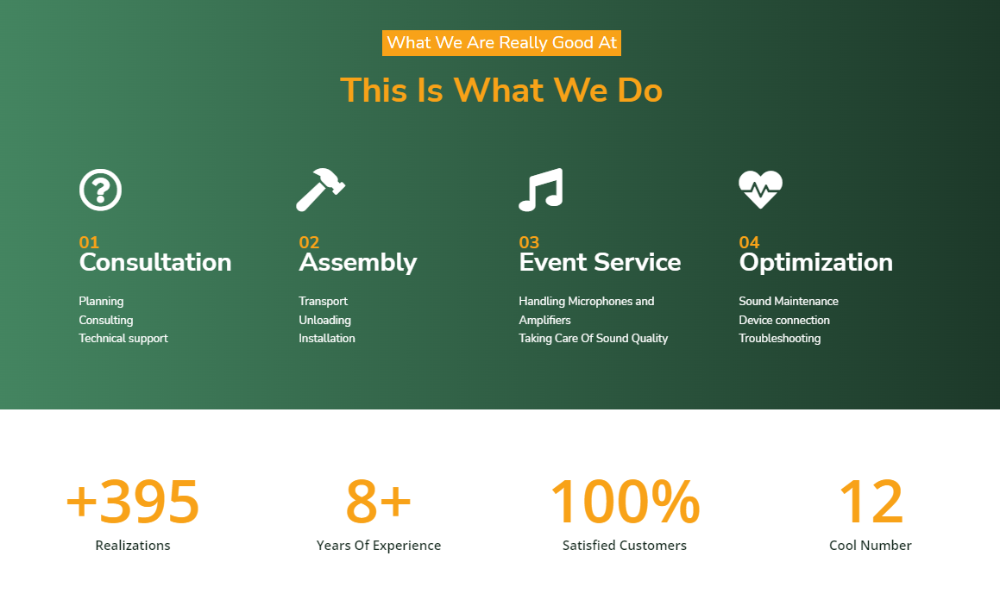

# Wordpress Projects

In this repository, will be presented pages made in wordpress, along with links to individual pages.

Technologies used:

-   Wordpress,
-   Elementor

01 - Business Card Website

The website was made for my friend's company, which provides sound at various events. The content of the page along with the graphics will change after discussing the details. The projects section and the blog will also be supplemented. The website is fully responsive.

Brief overview:

[Link to the application](https://business-card-website.netlify.app/)
